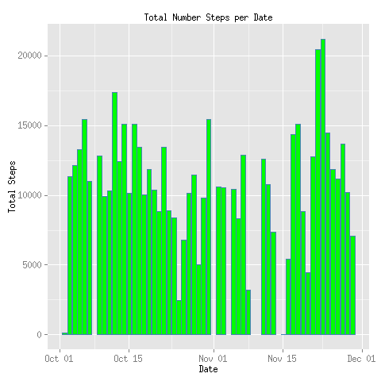
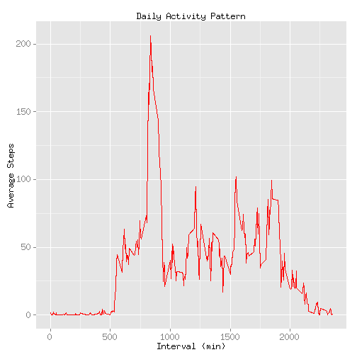

# Reproducible Research: Peer Assessment 1
For background of project, please refer to [README.md](https://github.com/linearregression/RepData_PeerAssessment1/blob/master/README.md)

## Download data and unzip locally

```r
zipData <- './activity.zip'
if(!file.exists("./activity.zip")) {
   print('Downloading activity.zip ....')   
   download.file(url='https://d396qusza40orc.cloudfront.net/repdata%2Fdata%2Factivity.zip', destfile=zipData, method='curl')
}
if(!file.exists("./activity.csv")) {
   print('Unzip activity.zip ....')  
   unzip(zipfile=zipData, overwrite=TRUE)
}
```
## Loading and preprocessing the data
Load data from csv

```r
Sys.setlocale(locale = "C")
```

```
## [1] "LC_CTYPE=C;LC_NUMERIC=C;LC_TIME=C;LC_COLLATE=C;LC_MONETARY=C;LC_MESSAGES=en_US.UTF-8;LC_PAPER=en_US.UTF-8;LC_NAME=C;LC_ADDRESS=C;LC_TELEPHONE=C;LC_MEASUREMENT=en_US.UTF-8;LC_IDENTIFICATION=C"
```

```r
fitdata<- read.csv(file='activity.csv', header=TRUE, stringsAsFactor=FALSE, na.strings = "NA", colClasses=c("integer", "Date", "integer"))
```
## What is mean total number of steps taken per day?
Group steps by date, then calculate mean number of steps.
Missing data is thrown away.

```r
library(plyr)
library(dplyr)
library(ggplot2)
#fitdata <-na.omit(fitdata)
sumfitdata <- ddply(fitdata,~date, summarise, stepssum=sum(steps, na.rm=TRUE)) 
p <- ggplot(data = sumfitdata, mapping = aes(x=date, y=stepssum)) +
     xlab('Date') +
     ylab('Total Steps') +
     ggtitle('Total Number Steps per Date')
p2 <- p +layer(geom = 'histogram', geom_params = list(fill='green',color = 'steelblue'), stat = 'identity', stat_params = list(binwidth=5))
print(p2)
```

 
 - Mean nubmer of steps taken per day:

```r
mean(sumfitdata$stepssum)
```

```
## [1] 9354
```
 - Median number of steps taken per day:


```r
median(sumfitdata$stepssum)
```

```
## [1] 10395
```

## What is the average daily activity pattern

Mean number of steps per group by intervals across all days are calculated.
Maximum value of such is also calculated. 

Following is a frequency distribution of Mean number steps per 5 min interval:


```r
library(plyr)
library(dplyr)
library(ggplot2)
activitydata <- ddply(fitdata,c('interval'), summarise, 
     mean=mean(steps, na.rm=TRUE)) 
p <- ggplot(data = activitydata, mapping = aes(x=interval, y=mean)) +
     xlab('Interval (min)') +
     ylab('Average Steps') +
     ggtitle('Daily Activity Pattern') 
p <- p+layer(geom="line", stat="identity", geom_params = list(color='red'))
print(p)
```

 
On average, maximum mean number of steps occurs at:


```r
# Find index on interval axis has the max mean number of steps
index <- which.max(activitydata$mean)
activitydata$interval[index]
```

```
## [1] 835
```

## Imputing missing values

Total number of missing data:


```r
sum(!complete.cases(fitdata))
```

```
## [1] 2304
```

## Are there differences in activity patterns between weekdays and weekends?

```r

```

