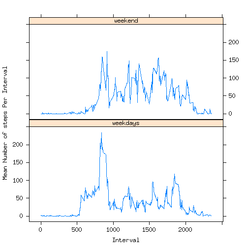

# Reproducible Research: Peer Assessment 1
For background of project, please refer to [README.md](https://github.com/linearregression/RepData_PeerAssessment1/blob/master/README.md)

## Download data and unzip locally

```r
zipData <- './activity.zip'
if(!file.exists("./activity.zip")) {
   print('Downloading activity.zip ....')   
   download.file(url='https://d396qusza40orc.cloudfront.net/repdata%2Fdata%2Factivity.zip', destfile=zipData, method='curl')
}
if(!file.exists("./activity.csv")) {
   print('Unzip activity.zip ....')  
   unzip(zipfile=zipData, overwrite=TRUE)
}
```
## Loading and preprocessing the data
Load data from csv

```r
Sys.setlocale("LC_TIME", "English")
```

```
## Warning: OS reports request to set locale to "English" cannot be honored
```

```
## [1] ""
```

```r
fitdata<- read.csv(file='activity.csv', header=TRUE, stringsAsFactor=FALSE, na.strings = "NA", colClasses=c("integer", "Date", "integer"))
```
## What is mean total number of steps taken per day?

Frequency distribution of daily total of steps taken. Missing data dropped.


```r
stepsFreq <- aggregate(steps~date, data=fitdata, sum, na.rm=TRUE)
colnames(stepsFreq) <- c('date','sum')
hist(stepsFreq$sum, xlab='Daily Steps taken', ylab='Occurence', main='Frequency distribution of daily total number of steps', col='cyan')
```

 
In additional to the histogram above, group steps by date to vizualize pattern by date. Missing data dropped.

```r
library(plyr)
library(dplyr)
library(ggplot2)
#fitdata <-na.omit(fitdata)
sumfitdata <- ddply(fitdata,~date, summarise, stepssum=sum(steps, na.rm=TRUE)) 
p <- ggplot(data = sumfitdata, mapping = aes(x=date, y=stepssum)) +
     xlab('Date') +
     ylab('Total Steps') +
     ggtitle('Total Number Steps per Date')
p2 <- p +layer(geom = 'histogram', geom_params = list(fill='green',color = 'steelblue'), stat = 'identity', stat_params = list(binwidth=5))
print(p2)
```

 
 - Mean number of steps taken per day:

```r
oldmean <- mean(stepsFreq$sum)
oldmean
```

```
## [1] 10766
```
 - Median number of steps taken per day:


```r
oldmedian <- median(stepsFreq$sum)
oldmedian
```

```
## [1] 10765
```

## What is the average daily activity pattern

Mean number of steps per group by intervals across all days are calculated.
Maximum value of such is also calculated. 

Following is a frequency distribution of Mean number steps per 5 min interval:


```r
library(plyr)
library(dplyr)
library(ggplot2)
activitydata <- ddply(fitdata,c('interval'), summarise, 
     mean=mean(steps, na.rm=TRUE)) 
p <- ggplot(data = activitydata, mapping = aes(x=interval, y=mean)) +
     xlab('Interval (min)') +
     ylab('Average Steps') +
     ggtitle('Daily Activity Pattern') 
p <- p+layer(geom="line", stat="identity", geom_params = list(color='red'))
print(p)
```

 

Interval where Max Mean happens and the corresponding max mean:


```r
# Find index on interval axis has the max mean number of steps
index<- which.max(activitydata$mean)
# Interval
activitydata$interval[index]
```

```
## [1] 835
```

```r
# Max Mean Steps
activitydata$mean[index]
```

```
## [1] 206.2
```


## Imputing missing values

Total number of missing data:


```r
sum(!complete.cases(fitdata))
```

```
## [1] 2304
```
Strategy to replace missing data. 
Try out replace missing data with mean and median per corresponding interval, then compare changes.
Since mean is senstive to extreme values, try out median.


```r
fitdata2<- read.csv(file='activity.csv', header=TRUE, stringsAsFactor=FALSE, na.strings = "NA", colClasses=c("integer", "Date", "integer"))
# Calculate mean and median number of steps per interval

stepmeanbyinterval<- aggregate(steps~interval, data=fitdata2,FUN=mean)
stepsmedianbyinterval <- aggregate(steps~interval, data=fitdata2,FUN=median)
# Replace NA data with mean
fitdata2ByMean <- fitdata2 %>% group_by(interval) %>% mutate(steps= replace(steps, is.na(steps), mean(steps, na.rm=TRUE)))

stepsFreqByMean <- aggregate(fitdata2ByMean$steps, by=list(fitdata2ByMean$date), sum, na.rm=TRUE)
colnames(stepsFreqByMean) <- c('date','sum')
hist(stepsFreqByMean$sum, xlab='Daily Steps taken', ylab='Occurence', main='Replacement of Missing Value as Mean', col='red')
```

 

```r
meanbymean <- mean(stepsFreqByMean$sum)
medianbymean <- median(stepsFreqByMean$sum)
#Difference vs data ignoring NA
meanbymean - oldmean
```

```
## [1] 0
```

```r
medianbymean - oldmedian
```

```
## [1] 1.189
```

```r
#Try this again with Replacement with Median per that interval
fitdata2ByMedian <- fitdata2 %>% group_by(interval) %>% mutate(steps= replace(steps, is.na(steps), median(steps, na.rm=TRUE)))
stepsFreqByMedian <- aggregate(fitdata2ByMedian$steps, by=list(fitdata2ByMedian$date), sum, na.rm=TRUE)
colnames(stepsFreqByMedian) <- c('date','sum')
hist(stepsFreqByMedian$sum, xlab='Daily Steps taken', ylab='Occurence', main='Replacement of Missing Value as Median', col='yellow')
```

 

```r
meanbymedian <-mean(stepsFreqByMedian$sum)
medianbymedian <- median(stepsFreqByMedian$sum)
#Difference vs data ignoring NA
meanbymedian - oldmean
```

```
## [1] -1262
```

```r
medianbymedian - oldmedian
```

```
## [1] -370
```
Note that using Replacement by mean strategy does not sway the result that much.

Replacement by median does as you notice most of day is idle except bursts of activity.
So expectation is both lower mean and median.
Replacement by mean assumes 'idle time' during the day is same as daily mean. 


## Are there differences in activity patterns between weekdays and weekends?


```r
library(plyr)
library(lattice)

Sys.setlocale("LC_TIME", "English")
```

```
## Warning: OS reports request to set locale to "English" cannot be honored
```

```
## [1] ""
```

```r
fitdata<-na.omit(fitdata)
# Add Weekday Factor variable of .
#Index of rows with weekdays and weekends respectively
fitdays <- weekdays(as.Date(fitdata$date))
weekdays <- (fitdays == 'Saturday') | (fitdays == 'Sunday')
fitdata$isWeekday <- as.factor(ifelse(weekdays, 'weekend', 'weekdays'))
fitdata <- group_by(fitdata, isWeekday)
activitydata <- ddply(fitdata,c('interval','isWeekday'), summarise, 
     mean=mean(steps, na.rm=TRUE))

xyplot(mean ~ interval| isWeekday, data =activitydata, type = "l", layout = c(1, 2),
    xlab = "Interval", ylab = "Mean Number of steps Per Interval", horizontal=FALSE)
```

 

Both mean and median are different on weekdays vs weekends.


```r
rr <- ddply(fitdata, .(isWeekday, steps, interval), summarise, mean=mean(steps, na.rm=TRUE))
meanwkend <- mean(rr$steps[rr$isWeekday=='weekend'], na.rm=TRUE)
meanwkday <- mean(rr$steps[rr$isWeekday=='weekdays'], na.rm=TRUE)

medianwkend <- median(rr$steps[rr$isWeekday=='weekend'], na.rm=TRUE)
medianwkday <- median(rr$steps[rr$isWeekday=='weekdays'], na.rm=TRUE)

data.frame(day=c('weekday', 'weekend'), 
           mean=c(meanwkday, meanwkend),
           median=c(medianwkday, medianwkend))
```

```
##       day  mean median
## 1 weekday 125.7     49
## 2 weekend 110.9     44
```


